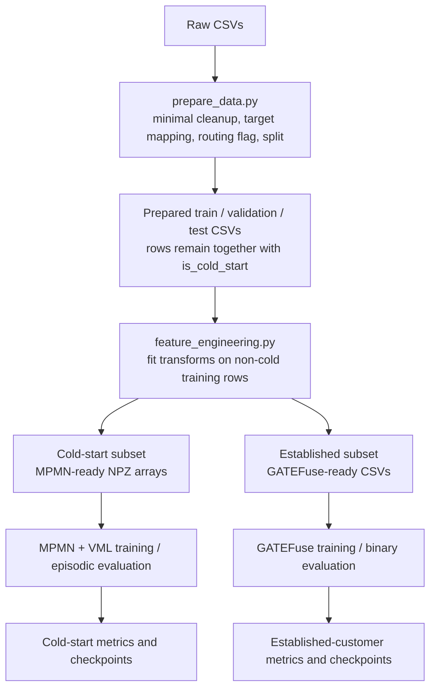

# Churn Prediction: Dual-Path Machine Learning Pipeline

This repository contains a tabular churn-prediction pipeline for three datasets. A dataset-specific rule marks rows as cold-start or established. The cold-start subset is modelled with an episodic prototype network (MPMN with Variational Metric Learning); established customers are modelled with GATEFuse, a group-aware neural classifier.

The pipeline prepares shared train/validation/test partitions, then builds separate model-ready representations for each path. The training and evaluation scripts run the paths independently; the repository does not provide a single production inference service that routes a new record and combines both model outputs.

## Contents

- [Research problem](#research-problem)
- [Research objectives and questions](#research-objectives-and-questions)
- [Architecture](#architecture)
- [Repository structure](#repository-structure)
- [Datasets](#datasets)
- [End-to-end pipeline](#end-to-end-pipeline)
- [Preprocessing and cold-start routing](#preprocessing-and-cold-start-routing)
- [Feature engineering](#feature-engineering)
- [Cold-start path: MPMN + VML](#cold-start-path-mpmn--vml)
- [Established-customer path: GATEFuse](#established-customer-path-gatefuse)
- [Training and evaluation](#training-and-evaluation)
- [Results](#results)
- [Configuration and running](#configuration-and-running)
- [Outputs](#outputs)
- [Dependencies](#dependencies)
- [Limitations and current caveats](#limitations-and-current-caveats)

## Research problem

The implemented problem is binary churn prediction when customer records provide differing amounts of tenure or service-history information. The code separates rows using explicit feature rules and applies a different model to each subset. This describes the implemented task; the repository does not establish comparative claims about the broader churn-prediction literature.

## Research objectives and questions

The project is framed around two objectives:

1. Develop and evaluate MPMN with Variational Metric Learning for churn prediction on the rule-defined cold-start subset.
2. Develop and evaluate GATEFuse for combining grouped customer features when predicting churn for established customers.

The associated research questions are:

1. How can churn prediction be improved for customers with limited behavioural history?
2. How can customer features be combined effectively to predict churn for established customers?

These questions describe the project framing. In the executable pipeline, “cold-start” is operationalized by the dataset-specific rules below; the code does not compute a separate interaction-density measure.

## Architecture



Routing is currently a deterministic preprocessing step. `prepare_data.py` creates the `is_cold_start` field; `feature_engineering.py` later partitions each split using that field. The model training scripts are separate and do not themselves route individual customers.

## Repository structure

```text
.
├── analysis/                         # Correlation and feature-importance plots
├── checkpoints/                      # Saved model weights and run-specific plots
│   ├── cold_start_/                   # MPMN checkpoints / cold-start experiment artifacts
│   └── non_cold_start/                # GATEFuse baseline and experiment checkpoints
├── datasets/
│   ├── original_datasets/             # bank.csv, telco1.csv, telco2.csv
│   ├── prepared/{bank,telco1,telco2}/ # Prepared splits, routing summaries, logs
│   ├── processed/                     # MPMN/GATEFuse features and experiment subsets
│   └── experimental_datasets/cold_start/ # Cold-start result CSVs and figures
├── models/
│   ├── cold_start/                     # MPMN and cold-start benchmark/ablation models
│   └── non_cold_start/                 # GATEFuse and other model variants
├── Outputs/
│   ├── Cold_Start_Outputs/             # Preprocessing and cold-start experiment logs
│   └── Non_Cold_Start_Outputs/         # GATEFuse baseline and experiment logs
├── scripts/
│   ├── cold_start_train.py
│   ├── cold_start_test.py
│   ├── non_cold_start_train_full_feature_set.py
│   ├── non_cold_start_test_full_feature_set.py
│   └── processing_engineering_scripts/
│       ├── prepare_data.py
│       ├── processing_module.py
│       ├── feature_engineering.py
│       ├── feature_engineering_defintions.py
│       └── non_cold_start_experiments/ # SMOTE, ADASYN, loss and correlation variants
└── README.md
```

This is a high-level map of the current relevant folders, not an exhaustive listing of every experiment, checkpoint, or analysis script. The feature-definition file is actually named `feature_engineering_defintions.py` in the repository.

## Datasets

The raw files currently present in `datasets/original_datasets/` have these sizes and target fields:

| Dataset key | File | Rows | Raw columns | Raw target | Cold-start rule | Model paths |
|---|---|---:|---:|---|---|---|
| `bank` | `bank.csv` | 10,000 | 18 | `Exited` | Tenure; additionally product count and activity for the 2-year case | MPMN + GATEFuse |
| `telco1` | `telco1.csv` | 7,043 | 50 | `Churn Label` | Tenure, contract, and total charges | MPMN + GATEFuse |
| `telco2` | `telco2.csv` | 7,043 | 21 | `Churn` | Tenure; optional referrals/offer clause is inactive because those columns are absent | MPMN + GATEFuse |

Column counts are raw CSV columns, including identifiers and targets. They are not the post-encoding model input dimensions. Dataset provenance/licensing details are not recorded in the current repository.

## End-to-end pipeline

1. **Prepare and route:** `prepare_data.py` reads each raw CSV, standardizes its target to `Churn`, creates `is_cold_start`, and saves unified train/validation/test CSVs and a routing summary.
2. **Engineer features:** `feature_engineering.py` splits each prepared partition by the flag, fits transforms on non-cold-start training rows, and writes model-specific datasets.
3. **Train:** `cold_start_train.py` trains MPMN models; `non_cold_start_train_full_feature_set.py` trains GATEFuse models.
4. **Evaluate:** `cold_start_test.py` evaluates episodically and compares few-shot baselines; `non_cold_start_test_full_feature_set.py` evaluates GATEFuse at 0.50.
5. **Inspect artifacts:** use the `datasets/`, `checkpoints/`, and `Outputs/` locations described below.

The main split is stratified by the joint combination of `Churn` and `is_cold_start`, with 70% train, 15% validation, and 15% test proportions and `random_state=42`.

## Preprocessing and cold-start routing

`MinimalPreprocessor` removes duplicate customer IDs when available, otherwise exact duplicate rows. It renames the configured target field to `Churn`; the feature engineer extracts it and maps supported values (`yes`/`no`, `true`/`false`, or `1`/`0`) to binary labels. It converts Telco-2 `TotalCharges` to numeric and fills missing values with zero, fills structural `Internet Type` nulls with `No Internet Service`, and handles missing values in detector fields. Model feature selection, scaling, and encoding are deferred to feature engineering.

The active detector rules in `RobustColdStartDetector` are:

- **Bank (`bank` strategy):** cold if `Tenure <= 1`, or if `Tenure <= 2` and `NumOfProducts == 1` and `IsActiveMember == 0`.
- **Telco-1 (`telco_depth` strategy):** cold if `Tenure in Months < 2`; or if tenure is below 3 and `Contract` contains `month`; or if `Total Charges == 0`.
- **Telco-2 (`generic`, threshold 2):** cold if `tenure < 2`; or, when both optional columns exist, if tenure is below 3 with zero referrals and `offer` equal to `none`, blank, or missing. The current `telco2.csv` has no referrals or offer columns, so only the tenure clause can trigger for this dataset.

The rule marks are proxies based on available dataset columns; the implementation does not measure interaction density. The saved summaries report:

| Dataset | Cold-start count | Cold-start rate | Cold-start churn rate | Established churn rate |
|---|---:|---:|---:|---:|
| Bank | 1,673 / 10,000 | 16.73% | 24.87% | 19.48% |
| Telco-1 | 834 / 7,043 | 11.84% | 60.07% | 22.03% |
| Telco-2 | 624 / 7,043 | 8.86% | 60.90% | 23.20% |

## Feature engineering

`ColdStartFeatureEngineer` and `EstablishedFeatureEngineer` use different dataset-specific feature definitions. Both are fitted on non-cold-start training rows. The cold-start engineer transforms the cold-start partitions; the established engineer transforms established partitions. The fitted encoders/scalers are applied to validation and test data rather than fitted again there.

Operations include numeric scaling, binary and ordinal mapping, one-hot encoding, service-state encoding for telecom variables, and configured feature creation. The Bank cold-start path creates a zero-balance indicator and caps `NumOfProducts` at 3. Configured referral, download, and charge variables receive `log1p` transformation. The cold-start path applies an absolute Pearson-correlation filter at 0.95 when configured; this filter is fitted on training features.

Baseline run logs report these post-encoding input dimensions:

| Dataset | MPMN input features | GATEFuse input features |
|---|---:|---:|
| Bank | 16 | 16 |
| Telco-1 | 40 | 50 |
| Telco-2 | 21 | 41 |

These are engineered model dimensions, not raw dataset column counts. GATEFuse derives Profile, Contract, Billing, and Usage groups from column names at runtime; unmatched columns are placed in Usage with a warning.

**Feature-level caveat:** the active Bank established-feature configuration retains `Complain`; a stored feature list also includes it. This potentially target-proximate feature should be reviewed when interpreting Bank metrics. The current repository does not provide a verified estimate of its overlap with the target or a matching ablation with `Complain` removed.

## Cold-start path: MPMN + VML

The MPMN encoder maps an input to a latent Gaussian represented by a mean and log variance. Two hidden linear layers use LayerNorm, ReLU, and dropout; separate projections produce the mean and log variance, with the latter clamped to `[-8, 4]`. Latent samples use the reparameterization trick.

In each episode, labelled support samples create one prototype per class. Prototype variance combines mean encoder variance and variation among support means. The query-to-prototype score is a Monte Carlo expected squared distance normalized dimension-wise by query plus prototype variance. The negative distance is divided by a learned positive temperature to produce class logits. Training uses query cross-entropy and a KL penalty on support and query latent distributions; the KL weight is annealed to a maximum of `0.001`.

The main trainer runs up to 150 epochs with 500 training episodes and 150 validation episodes per epoch. It uses Adam, cosine learning-rate scheduling, gradient clipping, and early stopping on smoothed validation loss. Key dataset settings are in `DATASET_CONFIGS` in `models/cold_start/cold_start_model.py`:

| Dataset | Hidden / latent dimension | Support per class | Train queries per class | Learning rate | Decision threshold |
|---|---:|---:|---:|---:|---:|
| Telco-1 | 64 / 32 | 10 | 15 | 0.001 | 0.50 |
| Telco-2 | 32 / 16 | 12 | 15 | 0.0005 | 0.48 |
| Bank | 64 / 32 | 15 | 15 | 0.001 | 0.38 |

`cold_start_test.py` evaluates with support/query episodes and reports Macro F1 and ROC-AUC, among other metrics. It also compares Random Forest and XGBoost fitted on few-shot support subsets. CTGAN augmentation is an optional separate step in `cold_start_ctgan_augment.py`; the current `cold_start_train.py` defaults to augmented training arrays for Bank and Telco-1, and the ordinary `train.npz` for Telco-2.

## Established-customer path: GATEFuse

The GATEFuse model encodes each of four feature groups with a linear projection, a residual path, and ReLU. Group attention produces softmax weights; per-group sigmoid gates modulate the weighted embeddings. The embeddings are concatenated and projected to a 128-dimensional fused vector. Two learned projections are multiplied elementwise, transformed to 64 dimensions, and passed to a sigmoid churn classifier.

The full-feature trainer uses binary cross-entropy, Adam (`lr=0.001`), batch size 32, and 40 epochs. It evaluates validation metrics every five epochs and saves the final model state. Test evaluation applies a fixed 0.50 threshold and reports positive-class precision, recall, F1, accuracy, ROC-AUC, a classification report, inference timing, and confusion matrix.

## Training and evaluation

| Model path | Train script | Evaluation script | Main metrics |
|---|---|---|---|
| MPMN + VML | `scripts/cold_start_train.py` | `scripts/cold_start_test.py` | Episodic Macro F1, ROC-AUC, ECE; test script includes RF/XGBoost few-shot comparisons |
| GATEFuse | `scripts/non_cold_start_train_full_feature_set.py` | `scripts/non_cold_start_test_full_feature_set.py` | Accuracy, positive-class precision/recall/F1, ROC-AUC, classification report, inference time |

Cold-start result CSVs and GATEFuse output logs represent different stored runs. Check the named source file for each result below; these metrics are not a direct head-to-head comparison between the two paths.

## Results

### Cold-start ablation results

`datasets/experimental_datasets/cold_start/ablation_study_results.csv` reports mean and standard deviation across three seeds. F1 is Macro F1; values are percentages.

| Dataset | MPMN + VML Macro F1 | MPMN + VML ROC-AUC | Point-estimate variant Macro F1 | Point-estimate ROC-AUC |
|---|---:|---:|---:|---:|
| Bank | 58.41 ± 0.11 | 75.58 ± 0.77 | 57.39 ± 1.24 | 77.40 ± 0.77 |
| Telco-1 | 66.94 ± 2.37 | 75.12 ± 3.00 | 71.59 ± 1.60 | 79.47 ± 0.66 |
| Telco-2 | 63.26 ± 0.87 | 70.46 ± 0.87 | 67.68 ± 1.38 | 75.06 ± 0.90 |

The point-estimate variant has higher Macro F1 and ROC-AUC on both Telco datasets; on Bank, the full model has higher Macro F1 while the point-estimate variant has higher ROC-AUC. This result does not establish a consistent advantage for VML across datasets.

### Separate cold-start benchmark

The extended benchmark is a separate result file and protocol (`extended_benchmark_results.csv`). Macro F1 values are percentages; model columns are not pooled with the ablation results.

| Dataset | MPMN + VML | Vanilla ProtoNet | Random Forest | XGBoost |
|---|---:|---:|---:|---:|
| Bank | 52.46 ± 0.79 | 55.30 ± 0.97 | 58.86 | 55.75 |
| Telco-1 | 68.63 ± 0.64 | 67.70 ± 0.77 | 59.36 | 54.99 |
| Telco-2 | 61.69 ± 0.61 | 70.21 ± 0.49 | 59.20 | 58.08 |

`basic_distance_baseline.csv` is yet another separate result file; it reports Macro F1 of 52.86 ± 0.66 (Bank), 56.94 ± 0.69 (Telco-1), and 65.99 ± 0.47 (Telco-2).

### Established-customer baseline results

`Outputs/Non_Cold_Start_Outputs/Experiment Set 1 - Full Feature Set.txt` contains these threshold-0.50 test metrics (percentages). GATEFuse F1 here is binary positive-class F1, not Macro F1.

| Dataset | Test records | Accuracy | Precision | Recall | F1 | ROC-AUC |
|---|---:|---:|---:|---:|---:|---:|
| Bank | 1,249 | 99.76 | 98.78 | 100.00 | 99.39 | 99.85 |
| Telco-1 | 932 | 96.03 | 92.42 | 89.27 | 90.82 | 98.76 |
| Telco-2 | 963 | 81.00 | 61.76 | 47.09 | 53.44 | 84.15 |

### Threshold experiment

A separate exploratory threshold sweep selects its threshold on test labels. Its adjusted scores are therefore omitted as generalization estimates; the primary GATEFuse results above use the evaluation script's fixed 0.50 threshold.

### Class-imbalance and loss-function experiments

The experiment logs report binary positive-class F1 at the default threshold. The table summarizes the recorded values and does not imply identical checkpoints across runs. Sources are the baseline, SMOTE, ADASYN, weighted-cross-entropy, and focal-loss files in `Outputs/Non_Cold_Start_Outputs/`.

| Experiment | Bank F1 | Telco-1 F1 | Telco-2 F1 |
|---|---:|---:|---:|
| Full-feature baseline | 99.39% | 90.82% | 53.44% |
| SMOTE | 99.18% | 86.90% | 47.49% |
| ADASYN | 99.39% | 89.49% | 44.79% |
| Weighted cross-entropy | 99.39% | 87.18% | 57.44% |
| Focal loss | 99.39% | 88.61% | 18.75% |

The Bank values across these logs share the `Complain` feature caveat described above. The Telco-2 SMOTE/ADASYN logs show high recall but lower precision; the single F1 value should be read with the full metrics in the corresponding output log.

## Configuration and running

The preparation script's `__main__` block uses the three files under `datasets/original_datasets/` and writes to `datasets/prepared/{telco1,telco2,bank}/`. Feature engineering is callable with `run(prepared_dir, dataset, out_dir)`; its default `__main__` writes to `datasets/processed/{dataset}/`.

The GATEFuse trainer specifically reads from `datasets/processed/baseline/{dataset}/gatefuse_ready/`. To prepare those paths using the same feature-engineering function, call it with a `baseline` output directory as shown below. From the project root:

```powershell
python scripts/processing_engineering_scripts/prepare_data.py
python scripts/processing_engineering_scripts/feature_engineering.py
```

The second command creates `datasets/processed/{dataset}/`. To create the `baseline` directory expected by the GATEFuse scripts, run from the project root:

```powershell
python -c "from scripts.processing_engineering_scripts.feature_engineering import run; [run(f'datasets/prepared/{d}', d, f'datasets/processed/baseline/{d}') for d in ('bank', 'telco1', 'telco2')]"
```

Then train and evaluate:

```powershell
python scripts/processing_engineering_scripts/cold_start_ctgan_augment.py
python scripts/cold_start_train.py
python scripts/cold_start_test.py
python scripts/non_cold_start_train_full_feature_set.py
python scripts/non_cold_start_test_full_feature_set.py
```

The CTGAN step uses the `sdv` package and generates the augmented arrays expected by the cold-start trainer for Bank and Telco-1. These are distinct scripts and commands; the repository has no single orchestrator for the full workflow. The feature-engineering and training scripts write artifacts and may overwrite existing outputs, so back up any run artifacts you need to retain before rerunning.

## Outputs

| Artifact | Location |
|---|---|
| Raw CSVs | `datasets/original_datasets/` |
| Prepared `train.csv`, `val.csv`, `test.csv`, routing summary/log | `datasets/prepared/{dataset}/` |
| MPMN arrays and feature names | `datasets/processed/{dataset}/mpmn_ready/` (or selected subset such as `baseline/`) |
| GATEFuse CSVs and scaler artifacts | `datasets/processed/{dataset}/gatefuse_ready/` (or selected subset such as `baseline/`) |
| MPMN checkpoints | `checkpoints/cold_start_/` |
| GATEFuse checkpoints and training plots | `checkpoints/baseline/` (created by the active full-feature training script); saved experiment variants are also under `checkpoints/non_cold_start/{variant}/` |
| Cold-start result tables and plots | `datasets/experimental_datasets/cold_start/` |
| Experiment logs | `Outputs/Cold_Start_Outputs/`, `Outputs/Non_Cold_Start_Outputs/` |
| Feature/correlation analysis plots | `analysis/` |

## Dependencies

No `requirements.txt`, environment file, dependency lock, or declared Python version is present. Imports in the core pipeline identify Python, NumPy, pandas, scikit-learn, joblib, PyTorch, and Matplotlib dependencies. Some optional paths additionally import XGBoost (cold-start benchmark), SDV (CTGAN), imbalanced-learn (SMOTE/ADASYN), SHAP, and plotting packages. The repository does not provide pinned versions or a verified installation command.

## Limitations and current caveats

### Research limitations

- The implementation operates on tabular customer snapshots; the core pipeline does not model longitudinal event sequences.
- The routing rules and feature-group rules are dataset-specific and depend on fields available in each CSV.
- The experiments cover three datasets, and the stored cold-start results show dataset-dependent performance.
- Bank results require careful interpretation because `Complain` is retained as a model input; a controlled leakage-removal comparison is not available in the checked-in result artifacts.

### Current artifact and reproducibility caveats

- Several files under `datasets/processed/{bank,telco1,telco2}/` contain unresolved Git conflict markers. Regenerating the outputs with `feature_engineering.py` overwrites those generated files. The `baseline` processed subset is a separate path used by GATEFuse training.
- Stored output logs and result CSVs do not consistently identify checkpoint hashes or source revisions. Results above are attributed to their repository artifact and should not be assumed to be reproducible from a particular current checkpoint without a matched rerun.
- The model paths are trained/evaluated separately; a combined online prediction or deployment interface is not present in the main scripts.

A scholarly reference list and dataset provenance statements are not established in the current checkout.


